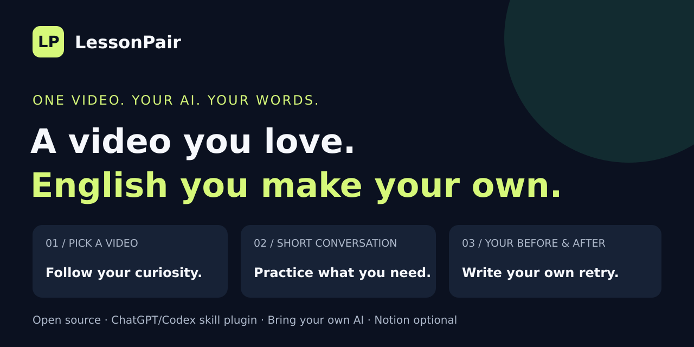

# LessonPair

## 교정받은 영어, 다음 수업에서도 꺼내 쓰세요.

**수업이 끝나면 쌓이는 작문과 피드백. 이번에는 다시 써보는 문제까지 연결합니다.**

[](examples/demo.md)

**[설치 없이 예시 체험하기](examples/demo.md)** · [스킬 설치](#gptcodex에서-사용하기) · [English](README.md)

| 내가 쓴 문장 | 교정한 문장 | 다음 연습 |
| --- | --- | --- |
| Trees gives shade. | Trees **give** shade. | 정답을 가리고 “나무는 그늘을 제공합니다.” 다시 쓰기 |

*이 문장은 공개 데모를 위해 새로 만든 가상 자료입니다.*

LessonPair는 영상 예습과 수업 후 작문·피드백을 **서로 연결된 노션 페이지 두 개**로 정리하는 오픈소스 스킬입니다. 원문을 남기고, 달라진 부분을 확인하고, 답을 가린 채 다시 써보도록 구성합니다.

공개 예시는 GitHub에서 바로 펼쳐볼 수 있습니다. 노션을 연결하거나 계정을 만들 필요는 없습니다. 실제 수업을 AI로 정리하고 노션에 저장하려면 스킬을 지원하는 도구와 노션 연결이 필요합니다.

**다음 수업에 써보고 싶다면 [설치 방법](docs/usage.md)을 확인하세요.** 나중에 찾기 쉽게 Star로 저장하거나, [불편한 점 한 가지](https://github.com/sjskoko/lesson-pair/issues/new?template=feature_request.yml)를 알려주세요.

## 수업 하나가 이렇게 남습니다

| ① 영상 예습 자료 | ② 수업·복습 기록 |
| --- | --- |
| 영상·제공된 자막·구간별 해석 | 직접 쓴 작문 원본·선생님 메모 |
| 표현과 문법 메모 | 문장별 교정·문법 설명 |
| 수업에서 사용할 표현 3개 | 정답을 가린 문제·재작문 |

원본은 보존하고, 선생님 피드백과 AI 보완을 구분합니다. 기존 수업은 이어서 수정하며, 미완성 문장의 의미나 점수·복습 완료 여부를 임의로 채우지 않습니다. 수업 목록·복습 대기·달력 보기를 활용하도록 안내합니다.

## GPT·Codex에서 사용하기

스킬 설치를 지원하는 환경에서 다음 폴더를 설치합니다.

`https://github.com/sjskoko/lesson-pair/tree/main/skills/lesson-pair`

설치 후 `@lesson-pair` 또는 호스트에서 지원하는 `$lesson-pair`로 호출합니다.

> 이 수업을 LessonPair로 정리해줘. 기존 영상 예습 자료와 연결하고, 내 작문 원본·선생님 메모를 보존해줘. 교정과 복습 문제도 추가해줘.

공개 저장소를 읽는 데 별도의 GitHub 접근 토큰은 필요하지 않습니다. **AI가 교정·정리할 때는 모델 토큰과 이용 한도가 적용**되며, 개인 노션에 저장하려면 노션 연결 권한이 필요합니다. 일반 커스텀 GPT가 이 저장소를 자동 설치하는 것은 아닙니다. 자세한 내용은 [사용 가이드](docs/usage.md)를 참고하세요.

## 로컬 도구 실행하기

Python 3.10 이상에서 실행합니다. 추가 패키지와 API 키가 필요하지 않습니다.

```bash
git clone https://github.com/sjskoko/lesson-pair.git
cd lesson-pair
python3 skills/lesson-pair/scripts/lesson_pair.py render examples/lesson.synthetic.json --out output/demo
python3 skills/lesson-pair/scripts/lesson_pair.py check output/demo/02-review.notion.md
```

이 명령은 입력된 가상 자료를 로컬 초안으로 정리합니다. AI 교정이나 노션 저장은 실행하지 않습니다. 노션용 Markdown은 연결 도구를 통한 작성용이며, 일반 편집기에 붙여 넣으면 표 태그가 그대로 표시될 수 있습니다.

## 개인정보와 공유

공개 예시는 모두 새로 만든 가상 자료입니다. 실제 학습 기록·연락처·개인 노션 주소는 포함하지 않습니다. 자신의 학습 기록은 공개 저장소에 올리지 마세요.

[공유용 소개문과 이미지](docs/launch.md) · [기여 안내](CONTRIBUTING.md) · [MIT 라이선스](LICENSE)
